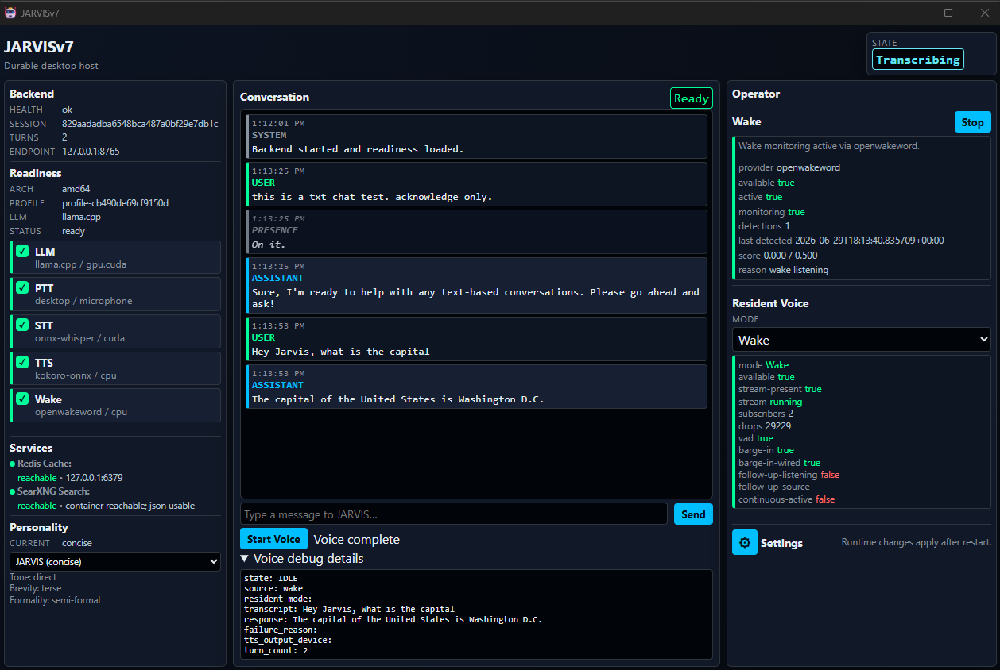

# J.A.R.V.I.S v7

 
 
 

* * *

## 📚 **J**ust **A**nother **R**estart, **V**alidated **I**teratively **S**ystem — Mark7

* Still not sentient.
* Still not flying the suit.
* Still not allowed to call vibes a validation strategy.
* Now with enough verified pieces that the remaining problems have nowhere polite to hide.

JARVISv7 is an attempt to build a **local-first, voice-first personal assistant** capable of real conversational interaction on hardware people actually own.

* Not someday.
* Not after moving everything to the cloud.
* Not after acquiring a budget, a board, or a marketing department.
* On the machine sitting in front of you.

JARVISv7 exists because v6 taught two important lessons:

> The vision was mostly right.  
> The implementation was occasionally creative.  

* Some architectural decisions worked exactly as intended - some did not.  
* Several worked just well enough to expose entirely different problems.  
* Which, in hindsight, is indeed progress.  

Since then, v7 has moved from "another restart with better rules" to "an actual construction site with permits, inspections, and a suspicious number of extension cords."

> A project that has finally become disciplined enough to discover how much work remains.

* * *

* * *

## 🚀 Quick Start

Fresh-clone setup and developer startup commands live in [docs/QuickStart.md](docs/QuickStart.md).

The short version: create `backend\.venv`, run `.\backend\.venv\Scripts\python scripts\bootstrap.py`, verify with `.\backend\.venv\Scripts\python scripts\validate_backend.py profile`, then use `scripts\run_backend.py`, `scripts\run_jarvis.py`, or the `desktop/` shell depending on what you are testing.

* * *

## 🧭 Project Vision ("The destination has barely changed")

The core vision for JARVIS has remained surprisingly stable.

* A local-first, voice-first assistant capable of maintaining conversational continuity, executing useful tasks, adapting to available hardware, and operating within a structured, observable runtime.

That vision existed long before v7. What changed was understanding how difficult it would be to achieve without letting the architecture wander into the woods wearing a little hat. The goal is still not to create a chatbot. The goal is not to create an autonomous agent that disappears into a black box.

> The goal is to build a system that can interact naturally while remaining understandable, controllable, and measurable.

### Core Invariants

* **Local-First Execution** — User-owned hardware remains the primary target.
* **Voice-First Interaction** — Speech is the intended interface, not an afterthought.
* **Desktop-First Presence** — The assistant should feel like a local runtime, not a website with a microphone button.
* **Hardware-Aware Startup** — Profiling, provisioning, and readiness come before runtime guessing.
* **Cross-Platform From the Start** — Windows x64 and Windows ARM64 are first-class targets, not apology notes.
* **Deterministic Control** — Explicit system behavior remains preferable to emergent chaos.
* **Externalized Cognition** — Memory, plans, artifacts, context, and traces live outside the model.
* **Personality as Policy** — Tone and behavior are configured, bounded, and inspectable.
* **Traceability** — Actions should be explainable after they occur.
* **Visible Failure States** — Empty output and silent collapse are not user experiences. They are crime scenes.
* **Validation Before Celebration** — Capability claims require evidence.
* **Incremental Progress** — Architecture advances one verified slice at a time.

> [ProjectVision.md](ProjectVision.md) contains the destination.  
> [SYSTEM_INVENTORY.md](SYSTEM_INVENTORY.md) tracks how much ground has actually been covered.

* * *

## 🎙️ Voice-First Reality Check

Voice remains the primary objective. *Not text*. *Not chat*. *Not prompt engineering*. **Voice**.

Significant progress has been made toward this goal throughout JARVISv7.

* Voice runtime families exist.
* Speech interaction paths exist.
* Wake and push-to-talk paths exist.
* Desktop interaction surfacing exists.
* Multi-turn/session foundations exist.
* Realtime conversation boundaries exist.
* Interruption and response coordination helpers exist.
* ARM64 voice validation is no longer purely theoretical, which is refreshing.

Several portions of the intended interaction model have now been validated in practice. There are still gaps. There are still rough edges. There are still moments where the system reminds everyone involved that speech recognition, conversation management, interruption handling, realtime coordination, and low-latency reasoning are all separate problems pretending to be one. The overall direction, however, remains unchanged.

> The goal is still conversational interaction that feels natural without pretending the underlying engineering is simple.

* * *

## 📈 Progress So Far ("Turns out quite a bit of this actually works")

One of the more surprising developments in JARVISv7 is that significant portions of the original vision have survived contact with reality. The project now contains verified implementations, validated workflows, documented inventories, governance controls, and evidence-backed capabilities that simply did not exist in earlier versions. Several major architectural goals have moved from **"interesting idea"** to **"demonstrated capability"**.

Examples include:

* Voice interaction pipelines (API layered backend - Python)
* Desktop runtime integration (Rust/Tauri/JavaScript)
* Hardware-aware execution paths (need more hardware - donations?)
* Persistent memory architecture (partial)
* Structured agent lifecycle management (almost)
* Multi-turn interaction foundations (needs work to be "conversational")
* Canonical turn/session engine shared across text and voice paths
* Local Redis/SearXNG service substrate
* Deterministic tool execution foundation
* Voice acceleration matrix and live turn gates
* Operator controls, settings UX, readiness panels, and degraded-state visibility
* Personality policy envelope with structured, bounded presentation controls
* Realtime conversation session boundary
* Conversation continuity and session memory boundary
* Truthful agent boundary with local ledger records
* Dry-run agent roles and read-only trace diagnostics
* Spec-first agent catalog and Agent Creator boundary
* Managed local llama.cpp LLM runtime with Ollama fallback

That is not a small list. It is, however, still not permission to declare victory and go buy sunglasses.😎

Not everything works everywhere. Not everything works perfectly. But increasingly, things either work or have documented reasons why they do not.

> That may not sound exciting — but really, it is.

* * *

## 🏗️ Current Reality ("The problems are more boring now")

Earlier versions spent considerable effort figuring out what JARVIS should become. The project is no longer primarily constrained by identity crises - it is constrained by engineering. JARVISv7 now spends considerably more effort figuring out why something that should work does not. This is a substantial improvement.

Current development focuses heavily on:

* agent framework expansion
* local LLM model hosting
* policy-gated cloud escalation
* memory storage and retrieval
* active learning loops for self-improvement
* realtime conversation coordination
* desktop/operator experience
* cross-platform runtime consistency

These are significantly less dramatic problems - Unfortunately, they are also real ones.

The active pain list still includes:

* latency
* reliability
* conversational flow
* voice interaction quality
* platform consistency
* architecture parity
* validation coverage
* hardware acceleration gaps
* unfinished agent integration
* incomplete memory depth

> The system remains incomplete - The difference is that incompleteness is increasingly measurable.  
> Which is rude, but useful.

* * *

## 🏃‍♂️‍➡️ Runtime Reality ("x64, ARM64, and the tiny furnace of truth")

JARVISv7 was explicitly shaped by the requirement that hardware support must not be retrofitted later while everyone pretends that was the plan. The project now has verified foundations across Windows x64 and Windows ARM64 for major parts of the stack. That includes profiling, provisioning, readiness, runtime validation, desktop host behavior, voice runtime matrices, and regression coverage across both host classes.

The local LLM story has also advanced significantly. Managed local `llama.cpp` support now exists through catalog/profile/sidecar/runtime/selector wiring, with Ollama remaining as a fallback path. CPU local `llama.cpp` has been live-proven on both AMD64 and ARM64.

That is real progress.

It is also not the same thing as saying every accelerator target is done. AMD64 CUDA and ARM64 QNN acceleration for the local LLM path remain skipped/degraded where viable sidecar artifacts or live accelerator completion have not been proven. Which is exactly how this project is supposed to talk now:

> prove it, degrade it, or stop claiming it.

* * *

## 💾 Memory ("It remembers things now, but let's not get emotional")

Memory is no longer just a concept duct taped to the side of the conversation engine. JARVISv7 now has a disk-backed episodic memory foundation with retrieval, write policy, cached recall, prompt assembly integration, and provenance tracking.

Session continuity has also become more explicit. The system can group related turns, create bounded continuity packets, preserve timeline artifacts, and carry session-aware context into prompt assembly.

That is a meaningful step toward the ProjectVision target of conversational continuity.

It is not the final memory system.

* Semantic/vector memory is still not implemented.
* Autonomous memory decisions are not being claimed.
* Redis is retrieval acceleration, not the source of truth.
* The durable memory authority remains disk-backed episodic entries.

In normal human terms:

> It can remember more than before. It does not yet have a soul. Please stop checking.

* * *

## ⚖️ Governance ("Assistants now have rules, it is apparently necessary")

One of the original reasons v7 exists was agentic coding assistant drift. Not the charming kind of drift. The kind where a system receives a scoped request and returns with an architecture, a migration plan, three abstractions, and a faint smell of ozone. v7 responds to that lesson by treating governance as architecture, not paperwork.

The repository now includes:

* a truthful agent boundary
* local ledger records
* role definitions
* policies
* dry-run planner/executor/critic/curator/learner helpers
* read-only trace diagnostics
* spec-first agent catalog
* deterministic spec-only Agent Creator boundary
* disabled-by-default agent specs for future expansion
* status truth that avoids pretending inactive things are secretly powerful

This is significant progress.

It is also intentionally bounded.

* No hidden/background execution is claimed.
* No autonomous agent runtime behavior is claimed.
* No model/tool-calling agent behavior is claimed.
* No training, deployment, semantic/vector memory, or desktop agent behavior is claimed by these entries.

That restraint is not a lack of ambition - It is the entire point.

> The system is not trying to become more creative.  
> The system is trying to become more correct.

* * *

## 🛠️ Tooling and Services ("Yes, it can do things. No, not whatever it wants.")

JARVISv7 now has a deterministic tool execution foundation. That matters because useful assistants eventually need to act in the world, and acting in the world without boundaries is how you get a very confident mess.

The current tool model is explicit and constrained.

* Tool invocation uses deterministic dispatch.
* Filesystem access is read-only and sandboxed.
* Internet search is routed through the existing provider boundaries and local service substrate.
* Tool-call metadata is carried through API and presentation surfaces.

This is not model-side function-calling chaos. This is not "the LLM found a tool and decided to vibe". The tool system exists. It is bounded. It is still early.

> It is also much safer than letting a language model free-climb your filesystem with a flashlight and a dream.

* * *

## 🧬 Personality and Presentation ("Snark, but governed")

Personality is now treated as a structured subsystem rather than a prompt seasoning. JARVISv7 includes validated personality profiles, policy adapters, prompt envelope integration, provenance-aware rendering, and bounded text/voice presentation cleanup. That supports the ProjectVision requirement that personality be externalized, configurable, inspectable, and compatible with deterministic orchestration. In practice, that means the assistant can develop a more consistent voice without being allowed to treat personality as a license to improvise facts, override policy, or become a theater kid with root access.

> The personality system is not magic. It is structure. Which is increasingly the whole brand.

* * *

## ⚠️ Remaining Gaps ("The hard parts turned out to be hard")

The remaining challenges are no longer:

* What should JARVIS be?
* Should it be voice-first?
* Should it be local-first?
* Should it use structured control loops?
* Should validation matter?
* Should agent drift be controlled?
* Should hardware differences be handled at the architecture level?

Those questions are largely settled.

The remaining work is mostly:

* improving reliability
* reducing latency
* refining interaction quality
* strengthening realtime voice behavior
* completing deeper interruption handling
* improving architecture parity
* improving accelerator coverage
* expanding memory beyond episodic keyword/recency retrieval
* integrating agents without creating a tiny bureaucracy of chaos
* proving remaining assumptions in live runtime evidence
* finishing the thing instead of discovering a new reason to restart it

> In other words: The roadmap increasingly consists of engineering problems rather than philosophical ones.  
> Which is encouraging... and inconvenient.  

* * *

## 🔁 What Changed From v6 ("Less drift. More discipline. More evidence.")

v6 demonstrated that the vision was achievable. It also demonstrated that capable systems can drift surprisingly far without strong controls. One of the most important lessons learned was that governance is not documentation. Governance is architecture. The repository now includes documented governance, validation harnesses, inventories, acceptance criteria, operational workflows, implementation boundaries, and capability tracking.

As a result, JARVISv7 places much greater emphasis on:

* validated execution
* acceptance criteria
* inventory management
* evidence collection
* implementation boundaries
* instruction fidelity
* operational discipline
* explicit degradation
* truthful capability reporting

v7 is not merely "v? but cleaner." It is v? with more of the original vision made concrete, more of the failure modes named directly, and fewer places for overachiever drift to hide under the floorboards.

> The system is not trying to become more creative. The system is trying to become more correct.  
> That sounds less exciting, but turns out to be far more useful.

* * *

## 🤝 Contributions Welcome

JARVIS has reached the stage where progress comes less from generating new ideas and more from executing existing ones consistently.

Contributions are welcome, particularly those that:

* improve platform support
* improve voice interaction
* improve memory and retrieval systems
* improve reliability
* reduce complexity
* strengthen validation
* improve hardware/runtime coverage
* improve agent boundaries without turning them into autonomous gremlins
* advance RAG, MCP, skills, agents, and local/cloud escalation without pretending they are already finished

**BONUS POINTS:** solving real problems without introducing three new ones.  
**DOUBLE BONUS POINTS:** documenting what actually happened instead of what would have been nice if it happened.

> The rules are stricter now. [AGENTS.md](AGENTS.md) is no longer a suggestion.

* * *

## 📜 License

Distributed under the MIT License.  

Use it. Modify it. Improve it. Break it. Don't complain about it.  

Just remember that experimental software occasionally behaves experimentally.  

> See [LICENSE](LICENSE) for "yada-yada" details.

* * *

## 🧱 Acknowledgments

Built on the accumulated successes, mistakes, redesigns, overcorrections, and occasional moments of accidental competence from:

* [**JARVISv1 (Just A Rough Very Incomplete Start)**](https://github.com/bentman/JARVISv1)  
  The beginning — many milestones, alpha nonetheless.

* [**JARVISv2 (Just Almost Real Viable Intelligent System)**](https://github.com/bentman/JARVISv2)  
  The first version that hinted this might actually be possible.

* [**JARVISv3 (Just A Reliable Variant In Service)**](https://github.com/bentman/JARVISv3)  
  The version that introduced stability.

* [**JARVISv4 (Just A Reimagined Version In Stabilization)**](https://github.com/bentman/JARVISv4)  
  The version that introduced discipline.

* [**JARVISv5 (Just A Runnable, Verified Iterative System)**](https://github.com/bentman/JARVISv5)  
  The first version that behaved like a system — without voice.

* [**JARVISv6 (Just Another Restart, Voice Included System)**](https://github.com/bentman/JARVISv6)  
  The version that proved the vision could work and exposed what still needed to be fixed.

* **JARVISv7 (Just Another Restart, Validated Iteratively System)**  
  The version currently proving that "under construction" and "making progress" can, occasionally, be the same thing.

* * *

## 🧩 Bottom Line

JARVISv7 is not attempting to reinvent the vision. It is attempting to realize it. The destination has changed very little. The amount of work required to reach it has become uncomfortably clear. That is not failure. That is understanding. For the first time in a while, construction appears to be outpacing reinvention. Which is probably the strongest progress indicator yet.

> "Sometimes you gotta run before you can walk." — Tony Stark
